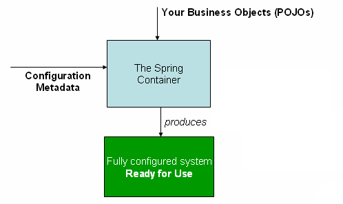

# 基本概念

### 依赖注入
* 从静态动态的角度

    原本，在类中利用组合方式new一个类是一种静态的实现，但是使用控制反转之后，类中的其它类依赖就可以在运行的时候通过DI（依赖注入）动态的加入到父类中去。

### SpringMVC
**SpringMVC是一种编程方法，它将javaWeb编程中的前端后端抽象为Modal，View，Controller，使得前端和业务逻辑与数据分离**
一个简单的示例: https://blog.csdn.net/qq_38449518/article/details/81545578

### Spring 容器
  

 https://zhuanlan.zhihu.com/p/98967126
**BeanFactory 就是由 Spring 容器初始化、装配及管理的对象，除此之外，bean 就与应用程序中的其他对象没有什么区别了。**
* Bean的对象： ApplicationContext
  * ClassPathXmlApplicationContext
  * FileSystemXmlApplicationContext

* Bean初始化时的过程
* Bean容器使用了工厂设计模式
### Bean
**Bean是spring容器管理的对象，这个对象拥有一些特殊的属性**

### IOC容器 API
* BeanFactory：BeanFactory 提供了 Spring 容器的配置框架和基本功能。
* ApplicationContext：BeanFactory 的子接口。它还扩展了其他一些接口，以支持更丰富的功能，如：国际化、访问资源、事件机制、更方便的支持 AOP、在 web 应用中指定应用层上下文等。