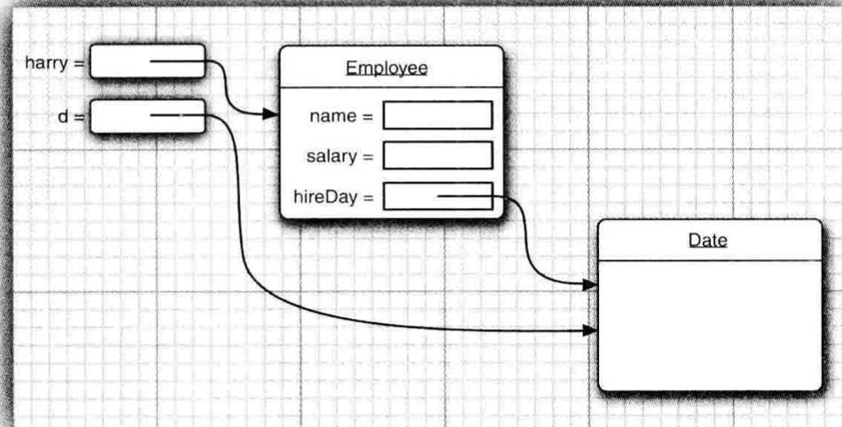

# Chapter 4 Notes

## 对象

### 对象的三个特征
* 对象的行为(behavior): 可以对对象施加哪些操作， 或可以对对象施加哪些方法?
* 对象的状态 (state ): 当施加那些方法时 对象如何响应?
* 对象标识(identity ): 如何辨别具有相同行为与状态的不同对象?

Notes: 如果在不经过方法调用就改变对象的状态，这说明程序的封装性遭到了破坏

### 对象作用域
Java 对象与基本类型具有不同的生命周期。当我们使用 `new` 关键字来创建 Java 对象时，它的生命周期将会超出作用域。因此，下面这段代码示例：
```java
{
    String s = new String("a string");
} 
// 作用域终点
```

### 是否更改对象状态：
调用这个方法后，对象的状态会改变, 这种方法称为更改器方法(mutator method) 
与之对应的是访问器方法（accessor method)
上例中，引用 s 在作用域终点就结束了。但是，引用 s 指向的字符串对象依然还在占用内存。在这段代码中，我们无法在这个作用域之后访问这个对象，因为唯一对它的引用 s 已超出了作用域的范围。在后面的章节中，我们还会学习怎么在编程中传递和复制对象的引用。

## 类之间的关系

* 依赖(“uses-a”) 
* 聚合(“has-a”) 
* 继承(“is-a”)


## 编译多个源文件：
```bash
javac Employee*.java
```

所有与通配符匹配的源文件都将被编译成类文件。 或者键人下列命令: 
```bash
javac EmployeeTest.java
```

读者可能会感到惊讶，使用第二种方式，并没有显式地编译`Employee.java`然而，当Java编译器发现`EmployeeTest.java` 使用了Employee 类时会查找名为 Employee.class 的文件。如果没有找到这个文件，就会自动地搜索 `Employee.java`, 然后，对它进行编译。更重要的是: 如果 `Employee.java` 版本较已有的 `Employee.class` 文件版本新，Java 编译器就会自动地重新编译这个文件。

注释:如果熟悉UNIX的“ make”工具(或者是Windows中的“ nmake”等工具，), 可以认为 Java 编译器内置了“make” 功能。

## 对象内的字段和方法
```java
class Employee
{
   private String name;
   private double salary;
   private LocalDate hireDay;

   public Employee(String n, double s, int year, int month, int day)
   {
      name = n;
      salary = s;
      hireDay = LocalDate.of(year, month, day);
   }

   public String getName()
   {
      return name;
   }

   public double getSalary()
   {
      return salary;
   }

   public LocalDate getHireDay()
   {
      return hireDay;
   }

   public void raiseSalary(double byPercent)
   {
      double raise = salary * byPercent / 100;
      salary += raise;
   }
}
```

*警告*:请注意，不要在构造器中定义与实例域重名的局部变量。例如，下面的构造器将无法设置 salary。
``` java
public Employee(String n, double s, . .
{
String name = n; // Error double salary = s; // Error
}
```

这个构造器声明了局部变量name和salary。这些变量只能在构造器内部访问。

这些变量屏蔽了同名的实例域有些程序设计者(例如，本书的作者)常常不假思索地写出这类代码，因为他们已经习惯增加这类数据类型。这种错误很难被检查出来，因此，必须注意在所有的方法中不要命名与实例域同名的变量。

### 显式与隐式参数
```java
public void raiseSalary(double byPercent) {
    double raise = salary * byPercent / 100;
    salary += raise;
}
```
`raiseSalary`方法有两个参数。第一个参数称为隐式(implicit)参数，是出现在方法名前的Employee类对象。第二个参数位于方法名后面括号中的数值，这是一个显式(explicit)参数。

在每一个方法中，关键字`this`表示隐式参数。如果需要的话，可以用下列方式编写 `raiseSalary`方法:

```java
Employee harry = . .
Date d = harry.getHi reDayO ;
double tenYearsInMilliSeconds = 10 * 365.25 * 24 * 60 * 60 * 1000; d.setTime(d.getTime() -(long) tenYearsInMilliSeconds);
// let's give Harry ten years of added seniority
```

出错的原因很微妙。d和harry.hireDay引用同一个对象(请参见图4-5)。对d调用更改器方法就可以自动地改变这个雇员对象的私有状态!

  

## 相同类之间的访问权限
从前面已经知道， 方法可以访问所调用对象的私有数据。 但是一个方法可以访问所属类的所有对象的私有数据，这令很多人感到奇怪, 例如：
``` java
class Employee
{
    public boolean equals(Employee other) {
        return name.equals(other.name) //or this.name.equals(other.name)
    }
}
```

调用方式:
```java
if (harry,equals(boss)) ...
```
这个方法访问 harry 的私有域， 这点并不会让人奇怪，然而，它还访问了boss的私有域。这是合法的，其原因是boss是Employee类对象，而Employee类的方法可以访问 Employee类的任何一个对象的私有域。

## `final` 修饰符


可以将实例域定义为final构建对象时必须初始化这样的域。也就是说，必须确保在每一个构造器执行之后， 这个域的值被设置， 并且在后面的操作中，不能够再对它进行修改。
``` java
class Employee
{
private final String name;
... }
```

但是如果吧`final`用在可变对象上，就会造成一些误会。这是因为final关键字只是表示存储在变量中的对象引用不会再指示其他对象。不过这个对象可以更改:
```java
// 定义一个final的可变类
private final StringBuiIcier evaluations;
// 构造其中初始化为：
evaluations = new StringBuilder();
// 在对象函数中使用这个对象
public void giveGoldStar()
{
   evaluations.append(LocalDate.now() + "哈哈")
}
```
在这个例子中，我们对evaluations所指的对象进行了改变，但是evaluations本身不能指向其他对象

## 重构函数
在java中，我们可以利用参数不同的函数进行函数的重构, 例如：

``` java
// housekeeping/OverloadingOrder.java
// Overloading based on the order of the arguments

public class OverloadingOrder {
    static void f(String s, int i) {
        System.out.println("String: " + s + ", int: " + i);
    }

    static void f(int i, String s) {
        System.out.println("int: " + i + ", String: " + s);
    }

    public static void main(String[] args) {
        f("String first", 1);
        f(99, "Int first");
    }
}
```

## this的使用

* 返回对象自己的引用
``` java
// housekeeping/Leaf.java
// Simple use of the "this" keyword

public class Leaf {

    int i = 0;

    Leaf increment() {
        i++;
        return this;
    }

    void print() {
        System.out.println("i = " + i);
    }

    public static void main(String[] args) {
        Leaf x = new Leaf();
        x.increment().increment().increment().print();
    }
}
```

increment返回了自己的引用，所以可以在increment()之后继续调用increment()

* 将对象自己传入一个外部方法
``` java
// housekeeping/PassingThis.java

class Person {
    public void eat(Apple apple) {
        Apple peeled = apple.getPeeled();
        System.out.println("Yummy");
    }
}
// ===================================
public class Peeler {
    static Apple peel(Apple apple) {
        // ... remove peel
        return apple; // Peeled
    }
}

public class Apple {
    Apple getPeeled() {
        return Peeler.peel(this);
    }
}
// ===================================
public class PassingThis {
    public static void main(String[] args) {
        new Person().eat(new Apple());
    }
}
```
* 将this当作构造器（只能在构造器中调用）
```java
// housekeeping/Flower.java
// Calling constructors with "this"

public class Flower {
    int petalCount = 0;
    String s = "initial value";

    Flower(int petals) {
        petalCount = petals;
        System.out.println("Constructor w/ int arg only, petalCount = " + petalCount);
    }

    Flower(String ss) {
        System.out.println("Constructor w/ string arg only, s = " + ss);
        s = ss;
    }

    Flower(String s, int petals) {
        this(petals);
        //- this(s); // Can't call two!
        this.s = s; // Another use of "this"
        System.out.println("String & int args");
    }

    Flower() {
        this("hi", 47);
        System.out.println("no-arg constructor");
    }

    void printPetalCount() {
        //- this(11); // Not inside constructor!
        System.out.println("petalCount = " + petalCount + " s = " + s);
    }

    public static void main(String[] args) {
        Flower x = new Flower();
        x.printPetalCount();
    }
}
```

注意在非构造器中是不能这么使用this的。

static的含义也有所拓展，我们在static方法中是不能存在this的，因为static方法只和类有关系，和对象没有。

## 垃圾回收
Java有自己的垃圾回收机制，但是这种垃圾回收并不能保证每一次对象使用结束能回收。事实上只要内存没有满，垃圾回收就有可能不会发生。如果程序执行结束，而垃圾回收器一直没有释放你创建的任何对象的内存，则当程序退出时，那些资源会全部交还给操作系统。这个策略是恰当的，因为垃圾回收本身也有开销，要是不使用它，那就不用支付这部分开销了。

要想理解 Java 中的垃圾回收，先了解其他系统中的垃圾回收机制将会很有帮助。一种简单但速度很慢的垃圾回收机制叫做引用计数。每个对象中含有一个引用计数器，每当有引用指向该对象时，引用计数加 1。当引用离开作用域或被置为 null 时，引用计数减 1。因此，管理引用计数是一个开销不大但是在程序的整个生命周期频繁发生的负担。垃圾回收器会遍历含有全部对象的列表，当发现某个对象的引用计数为 0 时，就释放其占用的空间（但是，引用计数模式经常会在计数为 0 时立即释放对象）。这个机制存在一个缺点：如果对象之间存在循环引用，那么它们的引用计数都不为 0，就会出现应该被回收但无法被回收的情况。对垃圾回收器而言，定位这样的循环引用所需的工作量极大。引用计数常用来说明垃圾回收的工作方式，但似乎从未被应用于任何一种 Java 虚拟机实现中。

在更快的策略中，垃圾回收器并非基于引用计数。它们依据的是：对于任意"活"的对象，一定能最终追溯到其存活在栈或静态存储区中的引用。这个引用链条可能会穿过数个对象层次，由此，如果从栈或静态存储区出发，遍历所有的引用，你将会发现所有"活"的对象。对于发现的每个引用，必须追踪它所引用的对象，然后是该对象包含的所有引用，如此反复进行，直到访问完"根源于栈或静态存储区的引用"所形成的整个网络。你所访问过的对象一定是"活"的。注意，这解决了对象间循环引用的问题，这些对象不会被发现，因此也就被自动回收了。

在这种方式下，Java 虚拟机采用了一种自适应的垃圾回收技术。至于如何处理找到的存活对象，取决于不同的 Java 虚拟机实现。其中有一种做法叫做停止-复制（stop-and-copy）。顾名思义，这需要先暂停程序的运行（不属于后台回收模式），然后将所有存活的对象从当前堆复制到另一个堆，没有复制的就是需要被垃圾回收的。另外，当对象被复制到新堆时，它们是一个挨着一个紧凑排列，然后就可以按照前面描述的那样简单、直接地分配新空间了。

## finilize
我们可以在对象内部定义一个finilize方法。在java垃圾回收的时候，首先会调用其 finalize() 方法，并在下一轮的垃圾回收动作发生时，才会真正回收对象占用的内存。

finalize() 还有一个有趣的用法，它不依赖于每次都要对 finalize() 进行调用，这就是对象终结条件的验证。

当对某个对象不感兴趣时——也就是它将被清理了，这个对象应该处于某种状态，这种状态下它占用的内存可以被安全地释放掉。例如，如果对象代表了一个打开的文件，在对象被垃圾回收之前程序员应该关闭这个文件。只要对象中存在没有被适当清理的部分，程序就存在很隐晦的 bug。finalize() 可以用来最终发现这个情况，尽管它并不总是被调用。如果某次 finalize() 的动作使得 bug 被发现，那么就可以据此找出问题所在——这才是人们真正关心的。以下是个简单的例子，示范了 finalize() 的可能使用方式：
```java
// housekeeping/TerminationCondition.java
// Using finalize() to detect a object that
// hasn't been properly cleaned up

import onjava.*;

class Book {
    boolean checkedOut = false;

    Book(boolean checkOut) {
        checkedOut = checkOut;
    }

    void checkIn() {
        checkedOut = false;
    }

    @Override
    protected void finalize() throws Throwable {
        if (checkedOut) {
            System.out.println("Error: checked out");
        }
        // Normally, you'll also do this:
        // super.finalize(); // Call the base-class version
    }
}

public class TerminationCondition {

    public static void main(String[] args) {
        Book novel = new Book(true);
        // Proper cleanup:
        novel.checkIn();
        // Drop the reference, forget to clean up:
        new Book(true);
        // Force garbage collection & finalization:
        System.gc();
        new Nap(1); // One second delay
    }

}
```


## 对象初始化

这章直接参考

概括一下创建对象的过程，假设有个名为 Dog 的类：

即使没有显式地使用 static 关键字，构造器实际上也是静态方法。所以，当首次创建 Dog 类型的对象或是首次访问 Dog 类的静态方法或属性时，Java 解释器必须在类路径中查找，以定位 Dog.class。
当加载完 Dog.class 后（后面会学到，这将创建一个 Class 对象），有关静态初始化的所有动作都会执行。因此，静态初始化只会在首次加载 Class 对象时初始化一次。
当用 new Dog() 创建对象时，首先会在堆上为 Dog 对象分配足够的存储空间。
分配的存储空间首先会被清零，即会将 Dog 对象中的所有基本类型数据设置为默认值（数字会被置为 0，布尔型和字符型也相同），引用被置为 null。
执行所有出现在字段定义处的初始化动作。
执行构造器。你将会在"复用"这一章看到，这可能会牵涉到很多动作，尤其当涉及继承的时候。
