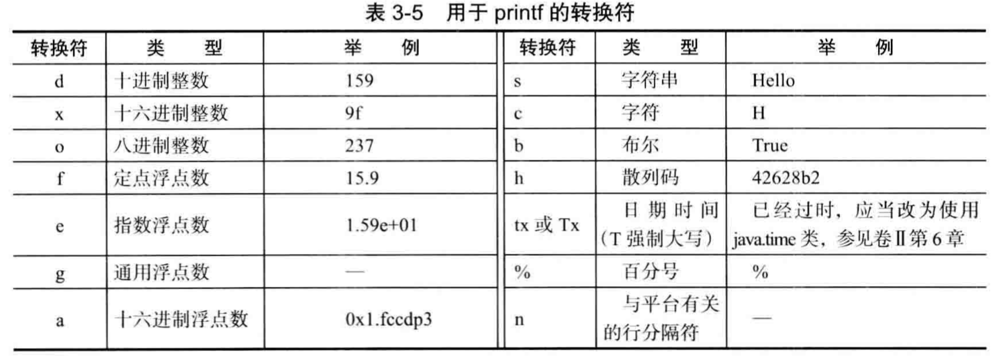
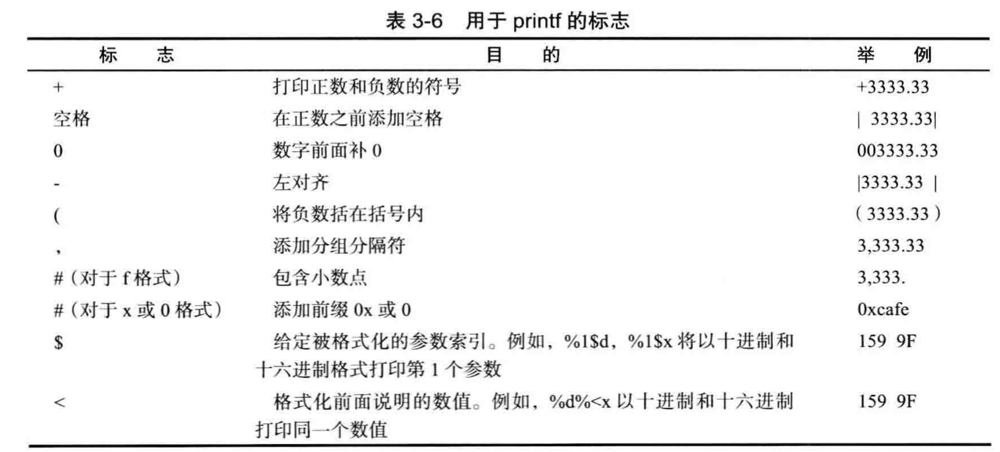
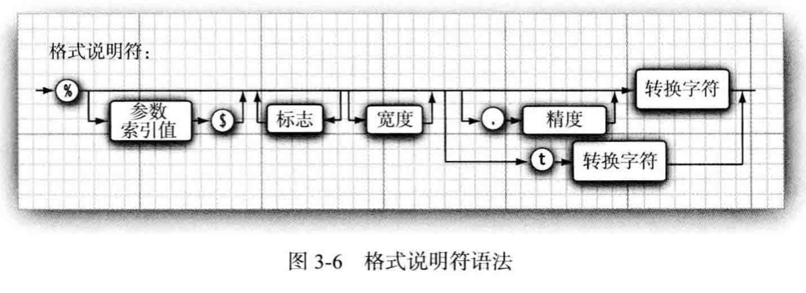
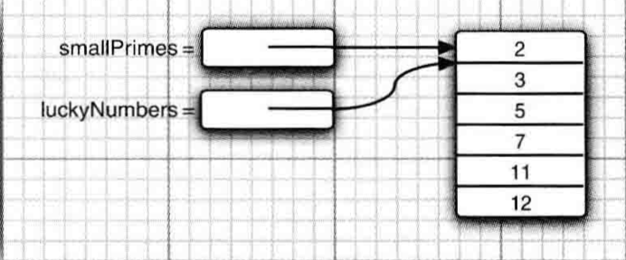

# Chapter 3 Notes

## 第一个程序，hello world

``` java
// Public: 指定了类的范围
public class FirstSample
{
   public static void main(String[] args)
   {
      System.out.println("We will not use 'Hello, World!'");
   }
}
```

三种注释：
* //
* /* */
* /** */ :自动生成文档


## 字符类型


### 浮点型
* 由于浮点型能表示的精读比较小，我们一般使用double
* float类型的数值有一个后缀F或f (例如，3.14F。) 没有后缀F的浮点数值(如3.14) 默 认为 double 类型。当然， 也可以在浮点数值后面添加后缀 D 或 d ( 例如， 3.14D)。

``` java
if (x = Double.NaN) // is never true
```
所有“ 非数值” 的值都认为是不相同的。 然而， 可以使用 Double.isNaN 方法: 

``` java
if (Double.isNaN(x)) // check whether x is "not a number"
```

浮点数值不适用于无法接受舍入误差的金融计算中。例如，命令System.out.println ( 2.0-1.1 ) 将打印出 0.8999999999999999, 而不是人们想象的0.9。 这种舍入误差的主要原因是浮点数值采用二进制系统表示

如果需要精度计算，我们可以使用`BigDecimal`类

### Char类型

Char 在java里面是unicode编码的字符

### 常量

``` java
public class Constants
   public static void main(String[] args) {
      final double NB = 2.54;
      ...
   }
```

关键词final声明之后的变量只能赋值一次

``` java
public class Constants
   public static final double NB = 2.54;
   public static void main(String[] args) {
      ...
   }
```
类常量的定义位于 maiii 方法的外部,在同一个类的其他方法中也可以使用这个常量。

如果一个常量被声明为public，那么其他类的方法也可以使用这个常量。

### 数值转化
Java中变量声明之后类型就不能随意改变，我们可以用`variable1 = (type)variable2`的形式进行类型转换

###  boolean 运算符

java支持三元操作符：
``` java
x<y?x:y
// 会返回 x 和 y 中较小的一个。
```

### 枚举类型
有时候，变量的取值只在一个有限的集合内。例如: 销售的服装或比萨饼只有小、中、 大和超大这四种尺寸。当然， 可以将这些尺寸分别编码为 1、2、3、4 或 S、 M、 L、X。但 这样存在着一定的隐患。 在变量中很可能保存的是一个错误的值(如 0 或 m )。

针对这种情况，可以自定义枚举类型。枚举类型包括有限个命名的值:
``` java
enum Size { SMALL, MEDIUM, LARGE, EXTRA_LARGE };
// Now we can delcare this variable:
Size s = Size.MEDIUM;
```

### 字符串
Java的字符串就是Unicode字符序列。因此，Java并没有内置的字符串类型

Declare a string:
``` java
String haha = "Haha"
```

Cut a substring from a string:

``` java
String haha = "Haha";
String s = haha.substring(0, 3);
```

拼接字符串:
``` java
String expletive = "Expletive"; 
String PC13 = "deleted";
String message = expletive + PC13;
```

当将一个字符串与一个非字符串的值进行拼接时， 后者被转换成字符串:
``` java
int age = 13;
String rating = "PC" + age;
```
rating 设置为“ PG13”

把多个字符串放在一起， 用一个定界符分隔， 可以使用静态 join 方法:
``` java
String all = String.join(" / ", "S", "M", "L", "XL");
```

Note: Java中的字符串是不可变的（Imutable），对一个字符串进行重新赋值并不会改变字符串本身，而是赋值一个新的字符串给变量。旧的字符串如果不使用的话会被自动垃圾回收。

可以使用 equals 方法检测两个字符串是否相等：
``` java
s.equals(t);
//如果字符串s与字符串t相等，则返回true; 否则，返回false。
```

如下的比较也是合法的
``` java
"Hello".equals (greeting);
"Hello".equalsIgnoreCase("hel1o") // 不区分大小写
```

Note: 一定不要使用==运算符检测两个字符串是否相等!这个运算符只能够确定两个字串 是否放置在同一个位置上。

### 空串和null
空串 "" 是长度为 0 的字符串:

``` java
if (str.length() = 0) // Check if str is a empty string
```

空串是一个 Java 对象，有自己的串长度(0)和内容(空)。不过，String变量还可以存放一个特殊的值，名为null, 这表示目前没有任何对象与该变量关联:

要检查一个字符串既不是 null 也不为空串:
``` java
if (str != null && str.lengthO != 0)
```

### 遍历字符串

Question: 如果我们想遍历一个字符串中的所有实际Unicode应该怎么办呢（并不是遍历char，因为在java中一个unicode字符不一定是一个char大小）

``` java
int[] codePoints = str.codePoints().toArray();
```

## 输入与输出

### 输出

``` java
import java.util.*;
// 创建一个scanner对象
Scanner in = new Scanner(System.in);
System.out.print("What is your name? "); 
// 读取一个整数
String name = in.nextLine();
System.out.print("How old are you? "); 
int age = in.nextlnt();
```

Note: 读取什么就需要调用相应的next函数

### 格式化输出

可以用 8 个字符的宽度和小数点后两个字符的精度打印 x。 也就是说，打印输出一个空格和7个字符，如下所示:

``` java
System.out.printf("%8.2f", x);
```

一些转化符：

  

此外，还可以增加各种标志在转化符中:
``` java
Systen.out.printf("%,.2f", 10000.0 / 3.0);
```
Print : 3,333.33

常用于printf的标志:

  

整个格式说明符的流程:

  


### 文件的输入输出

要想对文件进行读取， 就需要一个用 File 对象构造一个 Scanner 对象， 如下所示:
``` java
Scanner in = new Scanner(Paths.get("niyflle.txt"), "UTF-8");
```

要想写入文件， 就需要构造一个 PrintWriter 对象。 在构造器中， 只需要提供文件名:
``` java
PrintWriter out = new PrintWriter('myfile.txt", "UTF-8");
```

## 流程控制

Java的流程控制和C基本是一样的，这里着重记录一下break + label的使用方式

``` java
read_data:
while (. . .) // this loop statement is tagged with the label
{
   for (. . .) // this inner loop is not labeled
   {
      Systen.out.print("Enter a number >= 0: ");
      n = in.nextlnt();
      if (n < 0) // should never happen-can’t go on 
      break read.data;
      // break out of readjata loop
   }
}
// this statement is executed immediately after the labeled break
```
In this manner, we can jump out of while loop in the for loop

Note: 需要注意的是，这种方式只能跳出语句块， 而不能跳入语句块。

## 数组
Declaring an array:
``` java
int[] a = new int[100];
int a[] = new int[100];
```
在创建新数组的时候，不同类型的数组初始化数值不一样:

* 创建一个数字数组时， 所有元素都初始化为 0。
* boolean 数组的元素会初始化为 false 
* 对象数组的元素则初始化为一个特殊值null, 这表示这些元素(还)未存放任何对象。

获取数组的长度:
      
      array.length
注意这里的的length不是一个方法。

For each 循环：
``` java
for (int element : a) 
   System.out.println(element);
```

初始化数组：

``` java
int[] array = {1, 2, 3, 4, 5}
```

在不创建新变量的情况下初始化一个新的数组:
``` java
array = int[]{1,1,1,1,1,1,1}
```

在 Java 中， 允许数组长度为 0。 在编写一个结果为数组的方法时， 如果碰巧结果
为空， 则这种语法形式就显得非常有用。 此时可以创建一个长度为 0 的数组:

``` java
new elementType[0]
```
数组拷贝/深拷贝
``` java
//浅拷贝
int[] luckyNumbers = smallPrimes;
luckyNumbers[S] = 12; // now smallPrimes[5] is also 12
//深拷贝
luckNumbers = Arrats.copyOf(luckyNumbers, luckNumbers.length)
```

如果新数组的长度和原来不一样，那么如果数组元素是数值型，那么多余的元素将被赋值为 0; 如果数组元素是布尔型， 则将赋值为 false。 相反， 如果长度小于原始数组的长度， 则只拷贝最前面的数据元素。

 

如何创建不规则数组：
``` java
int[][] odds = new int[NMAX + 1][]; // 先规定行数
for (int n = 0; n <= NMAX; n++)
   odds[n] = newint[n+1]; // 对每一行规定列数
// 正常访问数组的元素
for (int n = 0; n < odds.length; n++) {
   for (int k = 0; k < odds[n] .length; k++) {
   // compute lotteryOdds odds[n][k] = lotteryOdds;
   }
}

```

### 动态数组的创建

基本类型的动态数组：
```
int [] array = new int[10];
// Produce a array with elements: [0, 0, 0, 0, 0, 0, 0, 0, 0, 0, 0, 0, 0, 0, 0, 0, 0, 0]
```

引用数组:
``` java
// housekeeping/ArrayClassObj.java
// Creating an array of nonprimitive objects

import java.util.*;

public class ArrayClassObj {
    public static void main(String[] args) {
        Random rand = new Random(47);
        Integer[] a = new Integer[rand.nextInt(20)];
        System.out.println("length of a = " + a.length);
        for (int i = 0; i < a.length; i++) {
            a[i] = rand.nextInt(500); // Autoboxing
        }
        System.out.println(Arrays.toString(a));
    }
}
```

这里，即使使用 new 创建数组之后：

```java
Integer[] a = new Integer[rand.nextInt(20)];
```

它只是一个引用数组，直到通过创建新的 **Integer** 对象（通过自动装箱），并把对象赋值给引用，初始化才算结束：

```java
a[i] = rand.nextInt(500);
```

### 可变参数列表
``` java
// housekeeping/VarArgs.java
// Using array syntax to create variable argument lists

class A {}

public class VarArgs {
    static void printArray(Object[] args) {
        for (Object obj: args) {
            System.out.print(obj + " ");
        }
        System.out.println();
    }
    
    public static void main(String[] args) {
        printArray(new Object[] {47, (float) 3.14, 11.11});
        printArray(new Object[] {"one", "two", "three"});
        printArray(new Object[] {new A(), new A(), new A()});
    }
}
```